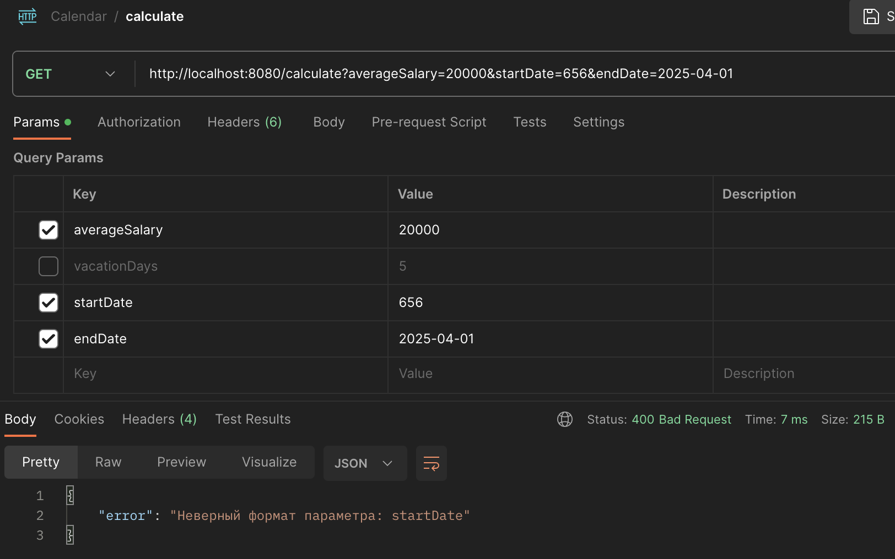

# VacationPayCalculator (Калькулятор отпускных)

## Содержание
1. [О проекте](#о-проекте)
2. [Особенности проекта](#особенности-проекта)
3. [Пример работы калькулятора](#пример-работы-калькулятора)
4. [Сборка](#сборка)

## О проекте

В этом небольшом проекте был создан микросервис с одним API, который позволяет рассчитывать отпускные по средней зарплате за 12 месяцев и количеству дней отпуска.
Помимо этих параметров в запросе можно указать дату начала и конца отпуска, и в расчете не будут учитываться выходные и праздничные дни. 
Используемые технологии:
* Java 11 - основной язык разработки;
* Spring Boot - создание микросервиса и автоконфигурации приложения;
* Spring Web - обработка HTTP-запросов и построение REST API;
* JUnit 5 - написание юнит-тестов;
* Mockito - создание моков и изоляция компонентов в тестах;
* Gradle (DSL-Kotlin) - сборка проекта и управление зависимостями;
* Postman - ручное тестирования REST API и отладка запросов.

## Особенности проекта

* Для расчёта отпускных используется формула: средняя зарплата за 12 месяцев / 29,3 (среднее количество дней в месяце по Трудовому Кодексу РФ) × количество дней отпуска. Результат округляется до двух знаков после запятой;

* Расчёт выполняется через  GET-запрос на адрес `/calculate`, который принимает параметры:

  * **salary** — средняя зарплата за последние 12 месяцев (обязательный параметр);
  
  * **vacationDays** — количество дней отпуска (обязательный параметр, если не указаны даты);
  
  * **startDate** и **endDate** — даты начала и конца отпуска, которые используются для исключения выходных и праздничных дней из расчёта (если не указано количество дней отпуска). Формат даты: YYYY-MM-DD.

  Параметры передаются через строку запроса (query string) в URL. Необходимо указать один из параметров для расчёта: либо количество дней отпуска (vacationDays), либо даты начала и конца отпуска (startDate и endDate).
    Примеры запросов:
  * `GET /calculate?salary=50000&vacationDays=10` — расчёт на основе количества дней отпуска;
  * `GET /calculate?salary=50000&startDate=2025-04-12&endDate=2025-04-20` - расчёт на основе дат начала и конца отпуска.
* Представлены следующие паттерны проектирования:

  * Стратегия — выбор подходящего способа расчёта отпускных в зависимости от входных параметров (по количеству дней или по диапазону дат). Список способов расчёта легко расширяется благодаря использованию интерфейса `PayStrategy`;
  * Строитель (Builder) — пошаговая настройка стратегии расчёта отпускных (класс `PayStrategyBuilder`)".
  
* Бин билдера настроен с областью видимости prototype, что гарантирует создание нового экземпляра на каждый запрос, обеспечивая независимость состояния между разными запросами;
* Логика расчетов и контроллер покрыты юнит-тестами, что гарантирует правильную обработку GET-запросов и проверку данных. Тесты проверяют корректность вычислений для разных параметров.

  	

    
	
	*Покрытие кода unit-тестами*
	

## Пример работы калькулятора

* Средняя заработная плата - 50 000, количество дней отпуска - 20. Результат расчета - 34 129.69:
    	

    
	
	*Пример расчета с укзанием количества дней отпускных*
	

* Средняя заработная плата - 50 000, дата начала отпуска 2025-04-07, конечная дата отпуска 2025-04-13. Результат расчета - 8 532.42:

   

    
	
	*Пример расчета с укзанием даты начала и конца отпуска*
	

* В случае отсутствия обязательных параметров или некорректного ввода данных возвращается статус ошибки и ее описание:
     

    
	
	*Пример расчета с укзанием некорректного формата даты старта отпуска*
	

## Сборка

Проект собирается с помощью Gradle (Kotlin DSL), JDK 11. Ниже представлены команды, которые можно прописать в консоли в корне проекта:

| Команда                                          | Описание                                                                |
|--------------------------------------------------|-------------------------------------------------------------------------|
| `./gradlew run`                                  | Запускает приложение напрямую без сборки JAR-файла                      |
| `./gradlew jar`                                  | Создает исполняемый JAR `build/libs/vacation-pay-calculator-1.0.jar`    |
| `./gradlew test`                                 | Запускает unit-тесты и генерирует отчет в HTML `build/reports/tests/test/index.html` |
| `./gradlew clean`                                | Очищает каталог сборки (`build/`), удаляя все сгенерированные файлы     |
| `java -jar build/libs/vacation-pay-calculator-1.0.jar` | Запуск собранного JAR (Linux/macOS)                               |
| `javaw -jar build/libs/vacation-pay-calculator-1.0.jar`| Запуск JAR без консоли (Windows)                                  |
